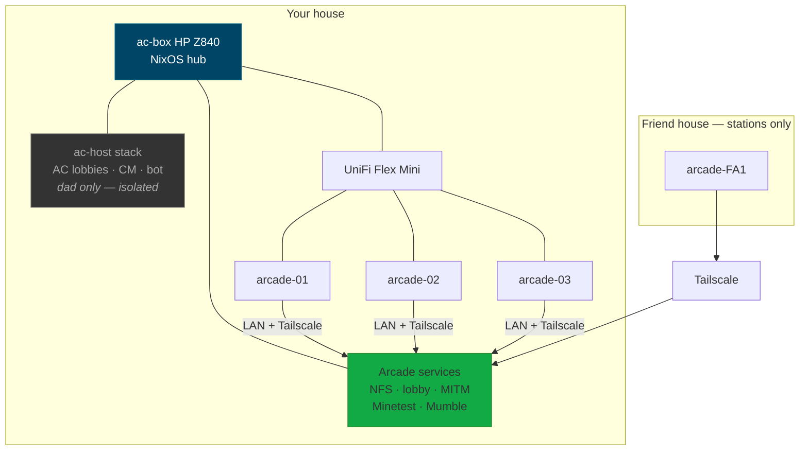
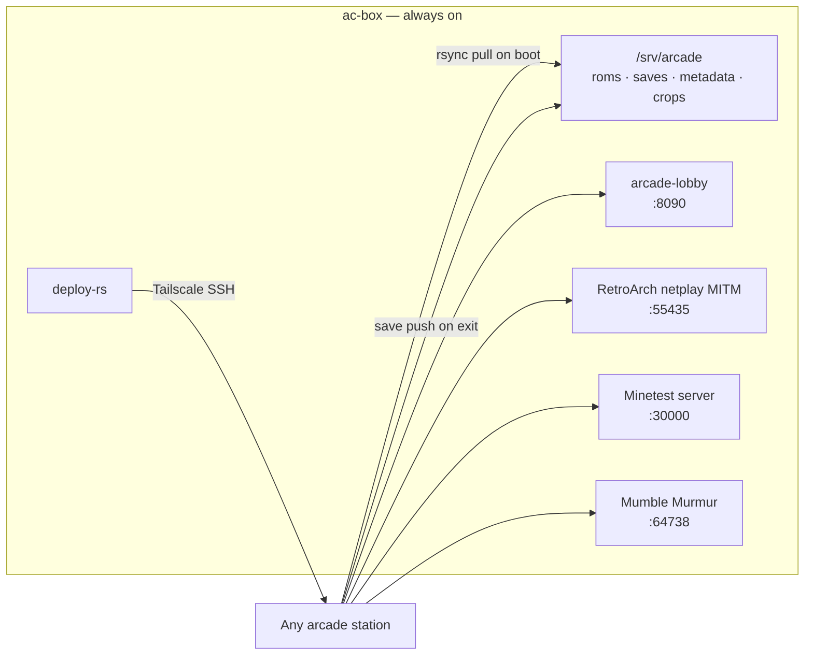
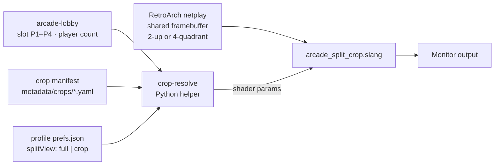
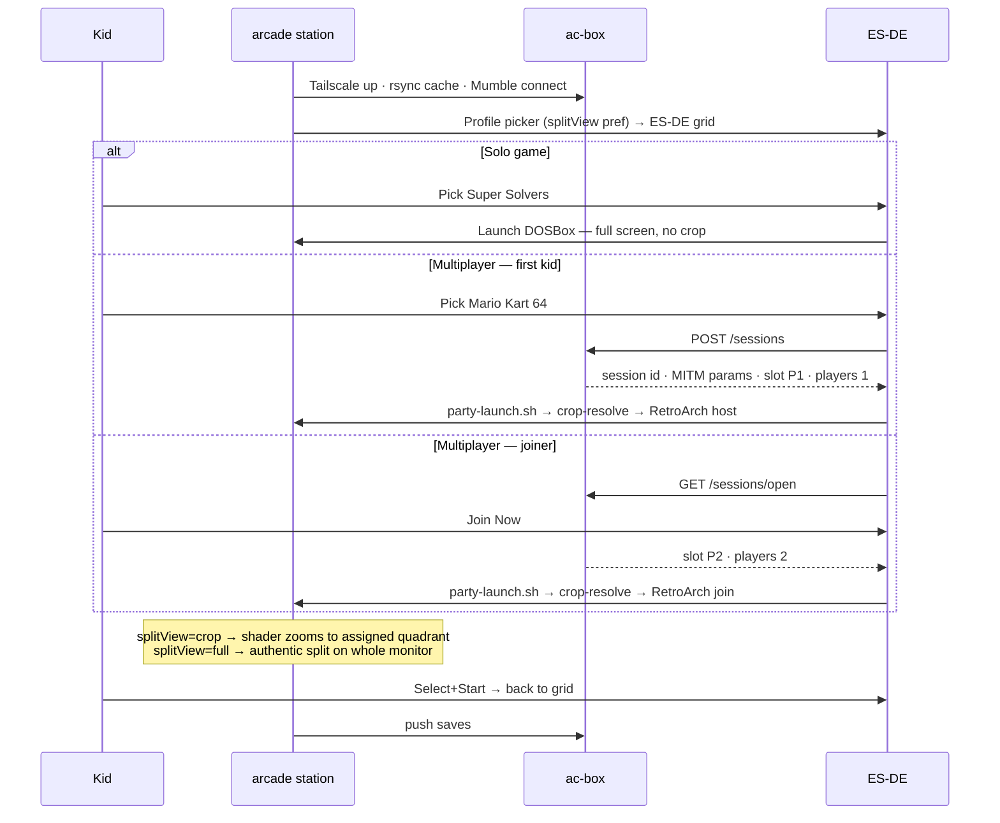
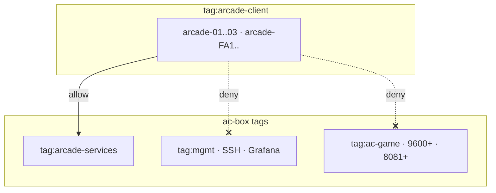

# Plan: home arcade — hub-and-spoke kiosk stations

Kids walk up to any station, pick a profile, pick any game. Multiplayer forms without asking an adult. Friend families run **stations only** — no server at their house — and connect to **`ac-box`** for content, sessions, and voice.

**Assetto Corsa is out of scope.** The existing `ac-host` stack (lobbies, CM, Discord bot, UniFi game port-forwards) stays on `ac-box` for dad's online racing. Arcade stations never install, mount, or reach AC content.

For ordered operator steps once implementation starts, see [`runbook-arcade.md`](runbook-arcade.md) *(not written yet)*.

---

## Decisions taken

| Decision | Choice | Rationale |
| --- | --- | --- |
| Hub | **`ac-box` only** | Other families will not host. One brain, many spokes. |
| Station OS | **NixOS** (`arcade-station.nix`) | Same lab model as `ac-box`: declarative, deploy from git, one push updates every enrolled station. |
| Kid launcher | **ES-DE** (EmulationStation-Desktop-Edition) | Largest Linux frontend community; controller-first; first-class RetroArch integration; launches native games via scripts. |
| Emulators | **RetroArch** | Netplay, SNES/N64/Genesis/DOS cores, pinned versions via Nix. |
| DOS (Super Solvers) | **DOSBox** via ES-DE | Correct tool for that era. |
| Native games | **Nix packages** on stations | `minetest`, `endless-sky`, `factorio` (unfree, licensed separately). |
| Content authority | **`/srv/arcade` on `ac-box`** | Master library; stations cache locally on boot. |
| WAN connectivity | **Tailscale** on `ac-box` + every station | Private mesh; no port-forwards at friend houses; remote stations reach hub services as if on LAN. |
| Emulated multiplayer | **RetroArch netplay MITM on `ac-box`** | Always on; no station acts as WAN host. |
| Split-screen display | **Local crop shader + per-profile pref** | Netplay delivers one shared framebuffer (authentic N64/SNES splits). Each station optionally crops to the player's quadrant and scales to full screen. Display-only — does not affect netplay sync. |
| Sandbox multiplayer | **Minetest server on `ac-box`** | Always on; one shared family world. |
| Session coordination | **`arcade-lobby` on `ac-box`** | Small HTTP service so kids never type room codes; ES-DE shows live "Join Now" banners. Returns player slot (P1–P4) and session player count. |
| Voice | **Mumble on `ac-box`** (primary) | Low latency, push-to-talk, parent-controlled, no kid accounts. Discord optional fallback for parents who refuse Mumble. |
| Session start | **Always-on + kid self-service** | No "ask dad to start X." All games visible at once; multiplayer auto-hosts or joins. |
| AC isolation | **Hard separation** | Separate NFS export, Nix profile, Tailscale ACL tags, firewall rules. |

---

## Ambiguities resolved

Each row is the binding answer — implementation should not re-litigate without updating this doc.

### Hub, network, and isolation

| # | Ambiguity | Resolution |
| --- | --- | --- |
| A1 | Do friend families host anything? | **No.** Stations only. All services on `ac-box`. |
| A2 | Does arcade share AC content or network paths? | **No.** `/srv/arcade` ≠ `/var/lib/ac-host`. Friend Tailscale ACLs reach `tag:arcade` ports only, not game lobbies or SSH. |
| A6 | NFS over the internet? | **Not raw.** Tailscale first; stations **rsync cache** locally on boot. Gameplay reads local disk; hub is authoritative for saves sync-back. |
| A7 | What if `ac-box` is down? | Solo emulated/native games work from **stale cache**. Multiplayer, voice, Minetest family world, and friend stations require hub up. Accepted tradeoff. |
| A18 | Does arcade use the game NIC port-forwards? | **No.** Arcade uses Tailscale and LAN to `ac-box`. AC WAN forwards unchanged on game NIC. |

### Sessions and kid UX

| # | Ambiguity | Resolution |
| --- | --- | --- |
| A3 | Who starts multiplayer sessions? | **Nobody.** `arcade-lobby` + always-on MITM/Minetest. First kid to pick a multiplayer game hosts; others see a "Join Now" banner. |
| A4 | Can three kids play three different things at once? | **Yes.** Stations are independent. Lobby matters only when a game needs sync. |
| A5 | One tile or separate solo/multiplayer tiles? | **One tile per game.** Launcher checks lobby: join open session if one exists, else create one. |
| A11 | Station ↔ kid assignment? | **None.** Any station, any time. Profile picker (Red / Blue / Green) selects save folder only. |
| A13 | First kid picks MK64, waits forever? | **15s grace**, then solo/time-trial if no joiner. Session stays advertised; late join may require resync (document per-game in runbook). |
| A16 | How does dad admin without kid access? | SSH to `ac-box` only (management path per [`plan-dual-nic.md`](plan-dual-nic.md)). Stations: Start+Select 3s → reboot. No desktop exposed to kids. |

### Content and hardware

| # | Ambiguity | Resolution |
| --- | --- | --- |
| A8 | Who owns ROMs for friend families? | **Legal:** hub stores the library for enrolled families; each parent attests ownership at onboarding. **Technical:** manifest lists filename + SHA256; deploy fails if local cache mismatch. FOSS titles need no attestation. |
| A9 | Factorio — free? | **No.** Commercial license (~$35 once). Optional for v1. |
| A10 | NES Mario Kart? | **Does not exist.** SNES *Super Mario Kart* and N64 *Mario Kart 64* are the targets. |
| A14 | ES-DE vs Pegasus vs Batocera? | **ES-DE on NixOS.** Batocera breaks central Nix deploy; Pegasus has smaller community. |
| A15 | Remote friend sees same menu? | **Yes.** Same flake, same ES-DE gamelist, same tiles. Synced from hub. |
| A17 | Disk size on stations? | **512 GB SSD** recommended (cache + metadata + native game layers). 256 GB tight once library grows. |

### Split-screen and crop (netplay display)

| # | Ambiguity | Resolution |
| --- | --- | --- |
| A19 | Does each station get a private full-screen camera in netplay? | **No — not from the emulator.** RetroArch netplay syncs one shared framebuffer. Without crop, every monitor shows the **same** split layout (2-up or 4-quadrant), like one N64 on one TV. |
| A20 | How do we get full-screen per kid? | **Local display crop only.** One RetroArch slang shader (`arcade_split_crop.slang`) zooms to the player's quadrant. Netplay is unchanged. |
| A21 | One toggle for all split-screen games? | **Yes.** Profile pref `splitView`: `"full"` (authentic split on whole monitor) or `"crop"` (my quadrant scaled up). Same toggle for MK64, Super Mario Kart, GoldenEye, and future crop-manifest games. |
| A22 | Who picks crop vs full — per station or per profile? | **Per profile**, applied on whichever station that kid uses. Two kids on crop + one on full in the same session is fine. |
| A23 | When does crop apply? | **Multiplayer emulated sessions only**, when a crop manifest exists for the game and player count. Solo play is always full screen. Pref `"full"` always shows the uncropped framebuffer. |
| A24 | How are crop regions defined? | **Per-game YAML** at `/srv/arcade/metadata/crops/<game_id>.yaml`. Generic templates live in `_layouts.yaml`. Games set `use_layout` and optional `region_overrides` / `bleed_px`. Layout selected by player count; region by lobby slot. |
| A25 | Toggle mid-race? | **v1: no.** Set on profile picker before play; applies next launch. **v2 (optional):** hotkey flips shader `CROP_ENABLED` without leaving netplay. |

---

## Architecture

### System context



### `ac-box` service map



### Split view pipeline (display-only, local to each station)



Netplay peers all receive identical video. Crop runs **after** sync, on the local GPU only.

### Station boot and multiplayer launch



### Security zones (Tailscale ACL intent)



---

## Split view (emulated multiplayer display)

### Default netplay behavior (no crop)

One synced framebuffer on every monitor — the same layout as a real console on one TV:

| Players | Typical layout (MK64, GoldenEye, SMK) |
| --- | --- |
| 2 | Vertical or horizontal halves |
| 3–4 | Four quadrants (2×2) |

Each station has its own monitor and controller, but **the pixels are identical** on all screens until crop is enabled.

### Crop mode

| Pref | What the kid sees |
| --- | --- |
| `full` | Entire split frame scaled to the monitor (authentic "mini N64 on each desk") |
| `crop` | Only their quadrant, scaled to full 1080p |

Crop is **display-only**. Inputs, netplay state, and lobby slot assignment are unchanged.

### Crop manifest (per game, on hub)

Path: `/srv/arcade/metadata/crops/<game_id>.yaml`

Generic templates: `/srv/arcade/metadata/crops/_layouts.yaml` (`vertical_halves`, `horizontal_halves`, `quadrants`).

Per-game files inherit, then override only when calibration needs it:

```yaml
# mario_kart_64.yaml — generic is enough
game_id: mario_kart_64
layouts:
  - when_players: 2
    use_layout: vertical_halves
  - when_players: [3, 4]
    use_layout: quadrants
```

```yaml
# goldeneye_007.yaml — override 4P after a screenshot pass
layouts:
  - when_players: [3, 4]
    use_layout: quadrants
    region_overrides:
      p1: { x: 0.05, y: 0.08, w: 0.42, h: 0.38 }
    bleed_px: 2
```

Repo copies live under `arcade/metadata/crops/`. `crop-resolve` merge order: `use_layout` → `region_overrides` → `bleed_px`.

v1 manifests: **mario_kart_64**, **super_mario_kart**, **goldeneye_007**.

### Profile preference

Path: `/srv/arcade/saves/<profile>/prefs.json`

```json
{ "splitView": "crop" }
```

Set on the **profile picker** screen: **"Big screen"** on/off (maps to `crop` / `full`). Not exposed in ES-DE settings for v1.

### Launcher integration

`party-launch.sh` (called from ES-DE for netplay titles):

1. Read lobby response: `game_id`, `slot` (p1–p4), `player_count`.
2. Read profile `splitView` pref.
3. Call `crop-resolve`: `(game, players, slot, pref) → shader params or passthrough`.
4. Write `/run/arcade-session.cfg` with `--appendconfig` for RetroArch.
5. Start RetroArch netplay (host or join via MITM on `ac-box`).

`crop-resolve` is a small Python helper in the arcade repo; manifests and shader ship via `/srv/arcade` sync.

### Shader

Single slang shader on hub: `/srv/arcade/shaders/arcade_split_crop.slang`

| Parameter | Meaning |
| --- | --- |
| `CROP_ENABLED` | `0` = passthrough (full split visible), `1` = crop active |
| `CROP_X`, `CROP_Y`, `CROP_W`, `CROP_H` | Normalized rect from manifest for this slot |

One shader implementation; all games differ only in manifest coordinates.

### Games without a crop manifest

Fall back to `full` (uncropped). Log a warning; no kid-facing error.

---

## Hardware

### Your house — per station ×3

| Item | Spec |
| --- | --- |
| Compute | Refurb 8th-gen Intel i5 mini PC — HP ProDesk 600 G4 Mini or Lenovo ThinkCentre M720q. **iGPU only (UHD 630 class). No discrete GPU.** |
| RAM / disk | 16 GB RAM, **512 GB SSD** |
| Display | 22–24″ 1080p monitor, **VESA 75×75 or 100×100** |
| Mount | VESA sandwich bracket (mini PC between stand and panel) |
| Controller | 8BitDo Ultimate **Wired** (Hall-effect sticks) |
| Headset | Wired USB — Logitech H390 or HyperX Cloud Stinger 2 |
| Cables | HDMI 3–6 ft, Cat6 3–6 ft, USB extension if rear ports tight |

| Station | IP | Hostname |
| --- | --- | --- |
| 1 | `192.168.1.101` | `arcade-01` |
| 2 | `192.168.1.102` | `arcade-02` |
| 3 | `192.168.1.103` | `arcade-03` |

### Your house — shared ×1

| Item | Notes |
| --- | --- |
| UniFi Flex Mini | 5-port; **USB-C PD 5 V / 3 A adapter required** |
| Cat6 uplink | Router/switch → Flex Mini in gaming room |
| Cat6 patches ×3 | Flex Mini → stations |
| Surge / small UPS | Switch + monitors |

### Friend house — per station ×1–2

Same station kit. **No server.** Plug into home router; you deploy and enroll via Tailscale.

### `ac-box` storage

Dedicated disk or partition for `/srv/arcade` — plan **500 GB+** as library grows.

---

## Software stack

| Layer | Component | Runs on |
| --- | --- | --- |
| OS | NixOS `arcade-station.nix` | Stations |
| Hub module | NixOS `arcade-hub.nix` | `ac-box` |
| Frontend | ES-DE | Stations |
| Emulation | RetroArch + cores (snes9x, mupen64plus-next, genesis, dos) | Stations |
| Split display | `arcade_split_crop.slang` + `crop-resolve` | Stations (shader local; manifest from hub) |
| Native | minetest, endless-sky, factorio (optional) | Stations |
| Content sync | `arcade-sync.service` — rsync pull on boot, push saves on exit | Stations |
| Crop manifests | `/srv/arcade/metadata/crops/*.yaml` | `ac-box` (synced to stations) |
| Lobby | `arcade-lobby` — sessions, slots, player count | `ac-box` |
| Netplay relay | RetroArch MITM | `ac-box` |
| World server | Minetest | `ac-box` |
| Voice | Murmur + Mumble client autostart | Hub + stations |
| Deploy | deploy-rs or `nixos-rebuild --target-host` | `ac-box` → stations |
| Mesh | Tailscale | Hub + all stations |

---

## Game catalog (v1 target)

| Category | Titles | Mode | Crop manifest |
| --- | --- | --- | --- |
| Racing | Mario Kart 64 | Solo · auto multiplayer | Yes |
| Racing | Super Mario Kart | Solo · auto multiplayer | Yes |
| Classics | GoldenEye 007 | Solo · auto multiplayer | Yes |
| Learning | Super Solvers (DOS) | Solo | N/A |
| Build | Luanti (Minetest), short view distance | Solo · Family World | N/A |
| Build | Mindustry | Solo · hub server | N/A |
| Logistics | OpenTTD | Solo · hub server | N/A |
| Explore | Endless Sky | Solo | N/A |
| Classics | Bomberman, SFII, Sonic 2, … | Per-game | Add manifest when needed |

All titles visible in ES-DE simultaneously. No locked rows.

Research backlog (not a deploy list): [`candidates.md`](candidates.md).

---

## Kid UX

### Boot

1. Power on → NixOS auto-login as `player`.
2. Background: Tailscale, content sync (spinner only if slow), Mumble connect.
3. **Profile picker:** Red / Blue / Green + **Big screen** toggle (`splitView`).
4. ES-DE fullscreen — curated category grid.

### Session discovery

Top strip when `arcade-lobby` has open sessions: **"JOIN NOW: Mario Kart 64 — 2 waiting"**. Any kid taps once to join. No room codes.

### Multiplayer launcher

```text
on emulated multiplayer game select:
  if open session for this game:
    join → lobby returns slot + player_count
  else:
    POST /sessions → host → slot P1
    show "Looking for racers…" (15 s)
    if no joiner → solo/time trial; session stays open

party-launch.sh:
  crop-resolve(game, player_count, slot, profile.splitView)
  retroarch --appendconfig /run/arcade-session.cfg …
```

Minetest **Family World** connects directly to `ac-box:30000` — no lobby, no crop.

### Exit and admin

| Action | Input |
| --- | --- |
| Exit game → grid | Select + Start |
| Reboot station (kids) | Start + Select hold 3 s |
| Parent admin | SSH to `ac-box` management path |

Kids never see desktop, terminal, room codes, or shader settings.

---

## `arcade-lobby` API (sketch)

Base URL: `http://ac-box.tailnet:8090` (MagicDNS name TBD).

| Method | Path | Purpose |
| --- | --- | --- |
| `GET` | `/sessions/open` | ES-DE polls → "Join Now" strip |
| `POST` | `/sessions` | Create session; returns MITM params + `slot` + `player_count` |
| `POST` | `/sessions/:id/join` | Returns `slot` + updated `player_count` |
| `DELETE` | `/sessions/:id` | Station exits |
| TTL | — | Empty session expires after 5 min |

Storage: Redis or SQLite on `ac-box`. Stateless stations.

---

## Friend family onboarding

| Step | Who | Action |
| --- | --- | --- |
| 1 | You | Send Tailscale invite to parent |
| 2 | You | Add station to deploy-rs targets |
| 3 | You | Mumble credentials + Tailscale ACL `tag:arcade-client` |
| 4 | Parent | Plug in pre-flashed station |
| 5 | Station | First boot: tailnet, sync, ES-DE ready |
| 6 | Parent | ROM attestation (one-time) |

Friend effort after day one: **power on.**

---

## Separation from `ac-host`

| | Arcade | Assetto Corsa (`ac-host`) |
| --- | --- | --- |
| NFS path | `/srv/arcade` | `/var/lib/ac-host/…` |
| Nix module | `arcade-hub.nix` | `ac-host.nix` |
| WAN ports | None (Tailscale) | 9600–9615, 8081+, … |
| Stations | ES-DE kiosk | Not deployed |
| Discord / CM | No | Yes |

Both run on the same `ac-box` hardware. Firewall and Tailscale ACLs enforce isolation.

---

## ac-box isolation (before battle test)

Landed as `modules/arcade-hub.nix`. Enabled on `ac-box` with **paths + LAN rsync only**. Lobby / MITM / Minetest / Mumble stay `enable = false` until the Windows netplay pass.

| Isolate | How |
| --- | --- |
| Filesystem | `/srv/arcade` + `/var/lib/arcade`. Never `/var/lib/ac-host`. |
| User | systemd user `arcade` — not Docker, not `ac` / `nixosuser` |
| Ports | 8090, 55435, 30000, 64738, 873 — **not** in AC ranges |
| Firewall | `networking.firewall.interfaces.enp8s0` only. No global `allowedTCPPorts`. No UniFi WAN forward. |
| Bind | `lanAddress = 192.168.1.50` — not `0.0.0.0` |
| Docker | Arcade is systemd / rsyncd. **Not** host-network compose. |
| AC firewall | **Unchanged this pass.** Moving 9600/8081 to interface-scoped is dual-NIC work — pause if players are in lobby. |

### What battle-test steps do to AC lobbies

| Step | Touches AC lobbies? | Why |
| --- | --- | --- |
| Edit repo / `arcade-hub.nix` / crop YAML | **No** | Files only |
| `nixos-rebuild switch` that only adds arcade-hub (no Docker change) | **Should not** | `ac-host-static` has `stopIfChanged = false`. Firewall reload is nftables swap. **Risk:** if the eval also changes `virtualisation.docker`, `docker.service` restarts and **every lobby dies**. Re-check `clients` immediately before rebuild; pause if > 0. |
| Open arcade ports on `enp8s0` | **No** | Additive rules. Existing AC UDP stays. |
| rsyncd on `:873` bound to `.50` | **No** | New daemon, new port |
| Start Minetest / Mumble / MITM later | **No** | Own ports, own user |
| Windows RetroArch ↔ MITM | **No** | Does not talk to 9600/8081 |
| Move AC ports from global → `enp8s0` only | **Yes, if wrong** | Dual-NIC / isolation follow-up. Can blackhole WAN joins if the interface name is wrong. **Drain if players present.** |
| Dual-NIC / systemd-networkd | **Yes** | See [`runbook-dual-nic.md`](runbook-dual-nic.md). Console-attended. |
| `compose up --build` / `docker.service` restart | **Yes** | Out of scope for arcade isolation |

---

## Battle test — Windows spokes

Two existing Windows boxes on `192.168.1.0/24` act as temporary RetroArch clients. **Not VMs.** Same hub; skip ES-DE / NixOS kiosk.

| ID | Role |
| --- | --- |
| `win-dev-01` / `win-dev-02` | Native RetroArch, pinned version, same ROM hashes |
| `ac-box` | rsync export now; lobby + MITM later |

First-run on any Windows PC (same Start-menu UX):

```powershell
cd arcade\windows
.\install.ps1                    # this box → Home Arcade shortcut
.\install.ps1 -StationId win-dev-02
```

`install.ps1` requires WSL + `rsync`, installs RetroArch 1.22.2, pulls `arcade-lib`, writes `%USERPROFILE%\arcade`, and creates **Home Arcade** on Start and the desktop.

Re-sync: `%USERPROFILE%\arcade\sync.ps1`  
Saves push: `.\sync.ps1 -PushSaves`

---

## Phased rollout

| Phase | Scope | Done when |
| --- | --- | --- |
| **1** | `arcade-hub.nix`: NFS, Minetest, Mumble, lobby stub | Hub services healthy in Grafana |
| **2** | One station: ES-DE, 5-game slice, sync, profile prefs | Kid plays solo, exits to grid |
| **3** | Three local stations, MITM netplay (crop off / full only) | Two kids race MK64 without adult |
| **4** | Crop manifests + shader + profile toggle for MK64, SMK, GoldenEye | Kid uses Big screen toggle; quadrants scale correctly |
| **5** | Join Now strip + full lobby integration | Self-service multiplayer |
| **6** | Tailscale + first friend station | Remote P4 joins MK64 |
| **7** | Polish: theme, volume cap, runbook | Hand kit to friend parent |

---

## Open items (not blockers for v1)

- **Factorio** headless on hub — enable when licensed.
- **Mumble subchannels** per active game — v1 uses one "Arcade Lounge" room.
- **Discord fallback** — parent-facing only.
- **Mid-race crop toggle** — v2 hotkey; v1 is profile picker only.
- **Late join mid-race** — per-core; document in runbook.
- **Crop calibration tool** — v2; v1 uses hand-tuned YAML + screenshot reference.
- **`runbook-arcade.md`** — operator steps mirroring [`runbook-dual-nic.md`](runbook-dual-nic.md) style.

---

## One-line summary

**`ac-box` runs the library, lobby, netplay relay, Minetest, and Mumble 24/7; every station is a self-service ES-DE kiosk; kids pick anything anytime; multiplayer finds itself; split view is a local crop toggle on the authentic netplay framebuffer; AC never touches the arcade.**
